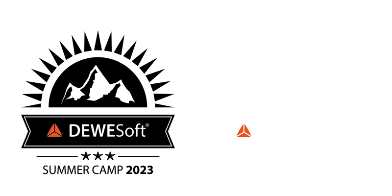

# SG Challenge Summer Camp2023

 
## Python installation
[inline link] (https://www.python.org/downloads/windows/)
## VSCode
[inline link] (https://code.visualstudio.com/)
## Environment installation, activation and libraries

python -m venv .venv   

set interpreter

.venv/Scripts/activate

pip install numpy

pip install pandas

pip install matplotlib 

...
